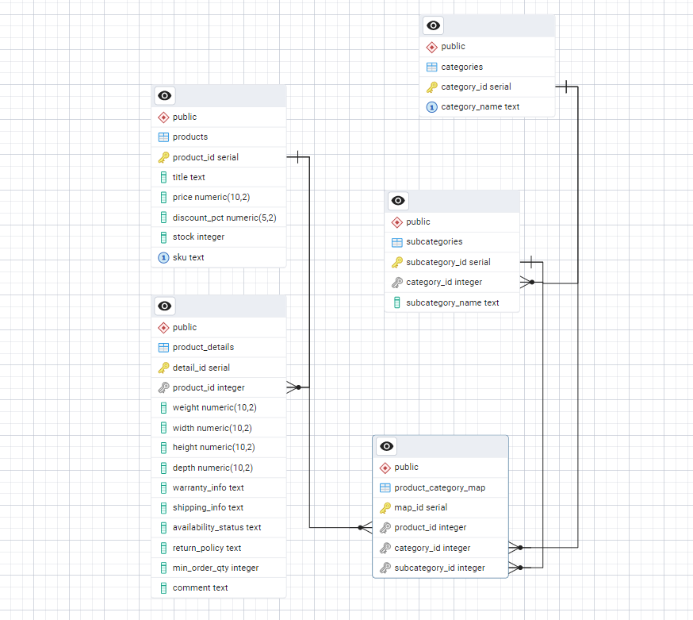

# E-commerce-ETL-Pipeline

## Project Overview

This project is an **end-to-end ETL (Extract, Transform, Load) pipeline** that simulates a real-world e-commerce data workflow. It demonstrates how raw data from an external API can be **processed, cleaned, and stored** in a relational database for analytics or reporting purposes. The pipeline is designed to be **modular, reusable, and easy to extend** for other data sources or projects.

---

## Project Description

The ETL pipeline performs the following key tasks:

- 🔹 **Extract** product data from the [DummyJSON API](https://dummyjson.com/), fetching raw JSON data.

- 🔹 **Transform** the data by **cleaning missing values**, **normalizing fields**, and **standardizing formats** to match a relational schema.

- 🔹 **Load** the transformed data into a structured format, either as **CSV files** or directly into a **PostgreSQL database** for analytics-ready use.

This project highlights practical **data engineering skills**, including:

- ✅ **API data extraction** and handling of JSON data  
- ✅ **Data cleaning, normalization, and transformation** with Python & Pandas  
- ✅ **Loading and mapping data** into relational databases using SQL and `psycopg2`  

It is part of my **Data Engineering learning journey**, showcasing hands-on experience in building a pipeline that bridges raw data sources and structured storage for analysis.

---

## Technologies Used  
- **Python** → scripting & data processing  
- **Pandas** → data cleaning and transformation  
- **psycopg2** → PostgreSQL connection from Python  
- **PostgreSQL** → relational database for structured storage  
- **Git & GitHub** → version control and project hosting  
- **pgAdmin4** → database management and ERD visualization  

---

## Project Structure  
```
E-commerce-ETL-Pipeline/
│
├── data/ # raw & transformed data (CSV files)
│ └── transformed_products.csv
│
├── src/ # source code for ETL
│ ├── Extract.py # extracts data from API
│ ├── Transform.py # cleans/transforms data
│ ├── Load.py # loads data into PostgreSQL
│
│── images/
│ └── schema.png # ERD Diagram
│
├── sql/
│ └── schema.sql # SQL script for creating tables
│
├── requirements.txt # Python dependencies
└── README.md # project documentation
```
## Database Schema & Design  

Below is the schema design for this project:  

  

---
### Tables  

- **`products`** → Stores core product information such as product name, price, discount percentage, stock, and SKU (unique identifier).  

- **`product_details`** → Holds extended product attributes (e.g., dimensions, weight, warranty, shipping details, availability, return policy, minimum order quantity, notes).  

- **`categories`** → Defines broad product categories (e.g., *Electronics, Fashion, Home Appliances*).  

- **`subcategories`** → Represents more specific categories under a main category (e.g., *Mobiles, Laptops* under *Electronics*).  

- **`product_category_mapping`** → Acts as a **junction table** linking `products` to both `categories`, `subcategories` and `product_details` for flexible many-to-many relationships.  

---
## ETL Workflow  

The pipeline follows the **Extract → Transform → Load (ETL)** process:  

- **Extract**  
  - Fetches product data from the [DummyJSON API](https://dummyjson.com/).  
  - Data is ingested in JSON format.  

- **Transform**  
  - Cleans and normalizes fields.  
  - Handles missing values.  
  - Renames columns for consistency with database schema.  
  - Stores the transformed dataset as a CSV file (`transformed_products.csv`).  

- **Load**  
  - Creates database schema from `sql/schema.sql`.  
  - Loads the cleaned data into **PostgreSQL** using `psycopg2`.  
  - Establishes relational mappings between products, product_details, categories, and subcategories.
 
---
## Setup & Installation

Clone the repository and install dependencies:

```bash
git clone https://github.com/your-username/E-commerce-ETL-Pipeline.git
cd E-commerce-ETL-Pipeline
pip install -r requirements.txt
```
---
## Usage Example

Run the ETL pipeline in order:

```bash
python src/Extract.py
python src/Transform.py
python src/Load.py
```

---
## Contributing
Contributions are welcome! Please open an issue or submit a pull request.

## Author

**Amankwe Amarachi Francisca**  
Data Engineering Enthusiast | Python & SQL | Aspiring Data Engineer  
[LinkedIn](https://www.linkedin.com/in/amankwe-amarachi/) | [GitHub](https://github.com/Anabelmara18)

